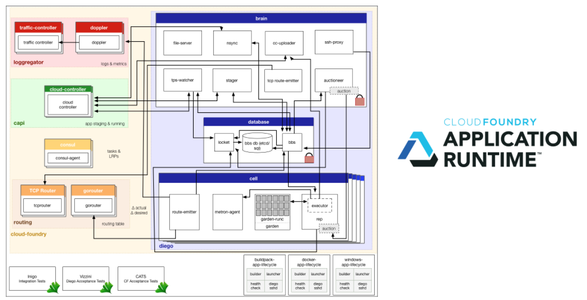
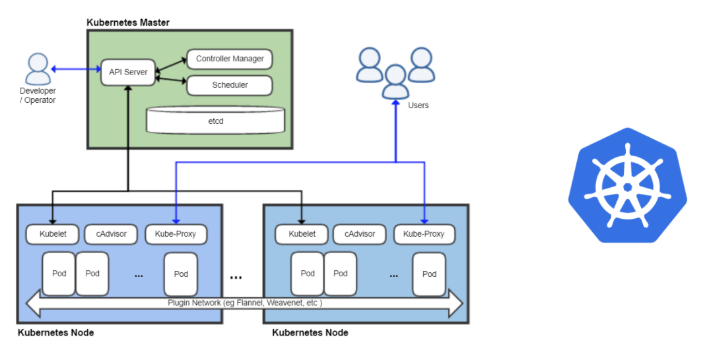
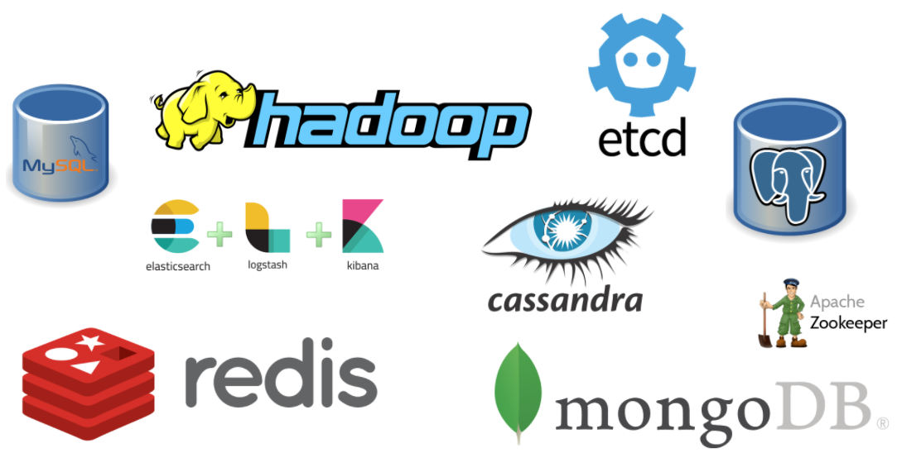
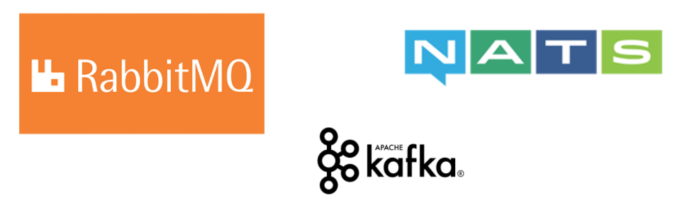
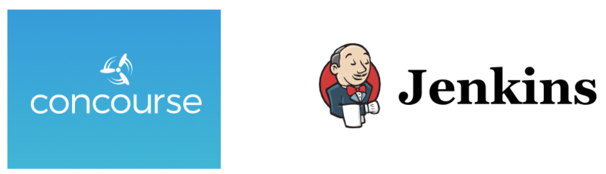
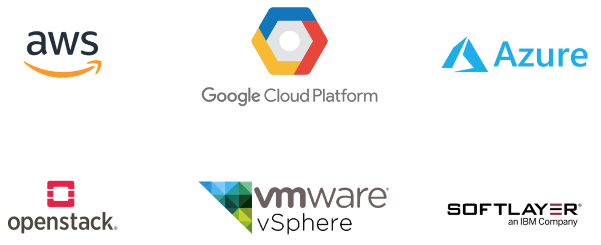
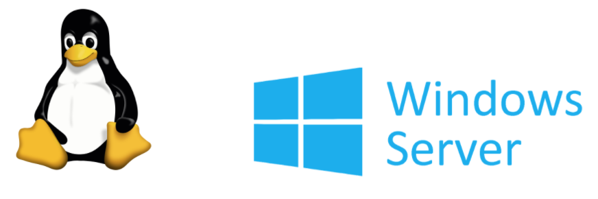
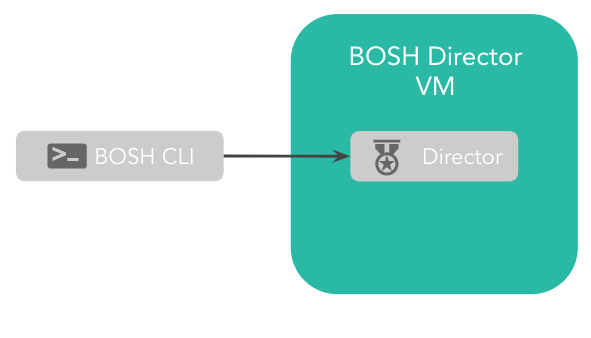

### What is BOSH?

 

- BOSH is an open source tool for release engineering, deployment, lifecycle management, and monitoring of distributed systems

- BOSH installs and updates software packages on large numbers of VMs over many IaaS providers with the absolute minimum of configuration changes

- BOSH orchestrates initial deployments and ongoing updates that are:  
  - Predictable, repeatable, and reliable  
  - Self-healing  
  - Infrastructure-agnostic  

 

--- 

### What can BOSH Deploy & Manage?

 

- Cloud Foundry Application Runtime  
  

 

- Kubernetes  
  

 

- Databases  
  

 

- Messaging Clusters  
  

 

- CI/CD Servers  
  

 
---

### What IaaS providers does BOSH support?

  

 

---

### What Operating Systems Does BOSH Support?

  

 

---

### The BOSH Project

 

- BOSH was created in 2010 by VMWare 
- 2013 Pivotal was spun out of VMWare taking BOSH with it
- Pivotal donated the BOSH project the the Cloud Foundry Foundation 
- BOSH is a project of the Cloud Foundry Foundation
- BOSH uses the Apache 2.0 License
- Actively developed since 2010
- 244 Contributors 
- Major contributions from CF Foundation members Pivotal, IBM, SAP, VMWare, Microsoft, Google and others 
- Resources   
  - http://bosh.io    
  - http://ultimateguidetobosh.com/ (Free Book)  
  - http://mariash.github.io/learn-bosh/ (Quick Tutorial)  
  - https://cloudfoundry.org/bosh/   
  - https://github.com/cloudfoundry/bosh   

 

---

### BOSH User Interaction

- The BOSH director is a collection of components that orchestrates the initial deployments and ongoing updates of bosh managed services 
- BOSH is a distributed system that can be deployed on multiple VM’s. However it is commonly deployed on a single VM
- A single BOSH director VM can manage thousands of other VMs 
- The BOSH CLI is a single go binary that can be installed on a Mac, Windows, or Linux to drive the BOSH director 

 
---

### Reference: Installing the BOSH CLI

 

Your workshop environment has the BOSH CLI already installed. 
For future reference on how to install it on your local environment, here is the documentation link for the setup steps:
- https://www.bosh.io/docs/cli-v2-install/

 
---