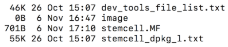
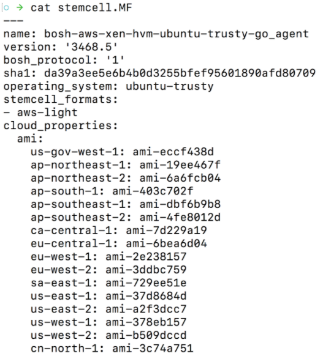

## What is a Stemcell?

- In biology a stemcell is a cell that can morph into a specialized cell  
  - stemcell → bone cell  
  - stemcell → liver cell  
  - stemcell → skin cell

- In BOSH a stemcell is a bare minimum OS image that can be morphed into a VM running specific software   
  - stemcell → VM running Redis 
  - stemcell → VM running HAProxy 
  - stemcell → VM running all the components of a Kubernetes worker node 

## BOSH Stemcell

- Secured, hardened, and versioned operating system image wrapped with IaaS specific packaging
- Contains a bare minimum OS skeleton with a few common utilities pre-installed, a BOSH Agent, and a few configuration files to securely configure the OS by default
- Stemcells are Windows or Linux based
- Maintained by BOSH team and available at http://bosh.io/stemcells  

- Reference: Building and Examining a BOSH Stemcell  
  - Official Stemcell documentation: https://bosh.io/docs/stemcell/  
  - Stemcell Builder: https://github.com/cloudfoundry/bosh-linux-stemcell-builder   

## Stemcell Metadata

- stemcell.MF
- stemcell_dpkg_l.txt
- MAJOR.MINOR format
- Major version is incremented when new features are added to stemcells
- Minor versions are incremented if certain security fixes backported on top of existing stemcell line. 
- We recommend to continuously bump to the latest major stemcell version to receive latest updates.

## Light Stemcells

- Available for public IaaS providers only 
  - AWS  
  - GCP  
  - Azure  
  - SoftLayer

- Does not contain the OS image rather references the OS image hosted by the IaaS provider   
  

- Small size file only about 20KB thus the name light stemcell

## The concept of stemcell solves the following problems

- Provides a base operating system image for installing software packages on 
- Versions changes to the OS image.   
  - If a library is changed for example openssl a new stemcell version is released  
  - Provides traceability of what is running on a VM  
  - Guarantees reproducibility

- Reusing base Operating System images across VMs of different types  
  - Eliminates snowflakes in your systems  
  - Simplifies patching / upgrades / maintenance   
  - Simplifies troubleshooting 

- Reusing base Operating System images across different IaaS providers  
  - BOSH software release only need to be built once and they will work the same on all IaaS providers 

- Stemcells are pre-hardened according to security best practices   
  - Building on top of a stemcells means more secure software
  - https://docs.pivotal.io/pivotalcf/security/pcf-infrastructure/stemcell-hardening.html  

---

