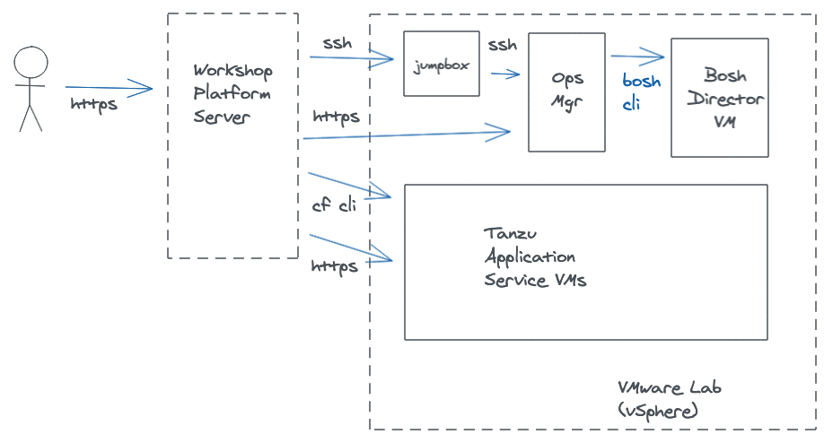

## Goal

Familiarization with Workshop Lab environment.

## Workshop Lab Architecture: Tanzu Application Service



### Using the TAS Operations Manager VM as a Jumpbox

The TAS Operations Manager VM can be used as a jump box to access and inspect a TAS deployment infrastructure, given that it is usually deployed inside of the TAS infrastructure network along with the BOSH Director VM and that it contains PCF and BOSH management tools pre-installed (e.g. uaac and bosh CLI's). ([TAS Knowledge Base article](https://community.pivotal.io/s/article/Using-bosh-and-uaac-cli-to-inspect-and-manage-pivotal-cloud-foundry-from-an-ops-manager-vm)).


## Part 1: Connect to the Ops Manager VM

1. Provide TAS Ops Manager VM's fully-qualified domain name from provided pre-workshop email

1. Provide corresponding ssh private key content from provided pre-workshop email

1. SSH into the jumpbox VM of your Lab environment

    ```execute
    ssh -o "StrictHostKeyChecking no" ubuntu@ubuntu-{{ LAB_SLOT_ID }}.haas-{{ LAB_SLOT_ID }}.{{ LAB_DOMAIN }}
    ```

    Type in the password for the environment provided by your instructor.


1. Once logged in to the jumpbox, SSH into the Ops Manager VM of your environment

    ```execute
    ssh -o "StrictHostKeyChecking no" ubuntu@opsmgr-01.haas-{{ LAB_SLOT_ID }}.{{ LAB_DOMAIN }}
    ```

1. Test connectivity with the Ops Mgr web interface

    [Click here to launch the Ops Manager user interface](https://opsmgr-01.haas-{{ LAB_SLOT_ID }}.{{ LAB_DOMAIN }})

    Login with credentials: `admin` / `<the same password provided by your instructor>`

1. Configure an alias for BOSH commands  

    The BOSH CLI requires several parameters to run commands, such as the targeted BOSH Director environment and authentication credentials. 

    To make that easier, you can define an alias containing all of those parameters and the Ops Manager web interface makes the content for that alias readily available in its credentials tab page.

    From the Ops Mgr web UI > Bosh Tile > Credentials tab ([link](https://opsmgr-01.haas-{{ LAB_SLOT_ID }}.{{ LAB_DOMAIN }}/api/v0/deployed/director/credentials/bosh_commandline_credentials)), copy the contents of "Bosh Command line Credentials" and then define the alias issue the following command:  

   `alias bosh="<command-from-ops-mgr-panel>"`


## Part 2: Inspect the Bosh Director environment

1. Check which BOSH deployments exist 

    ```execute
    bosh deployments
    ```

1. Check for BOSH managed VMs for the existing deployments

    ```execute
    bosh vms
    ```

